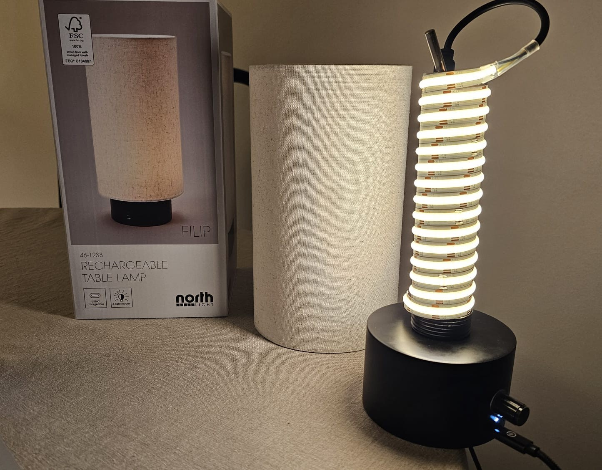
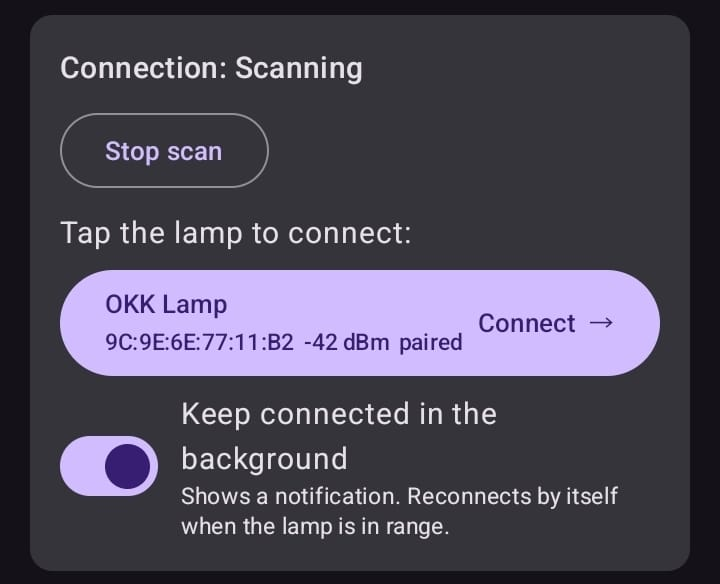
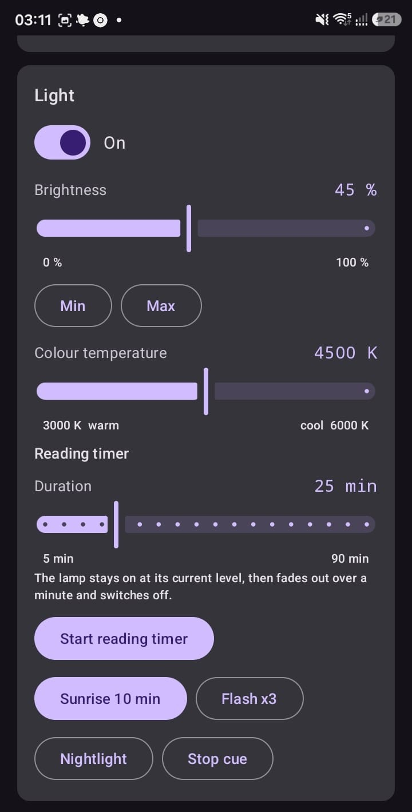
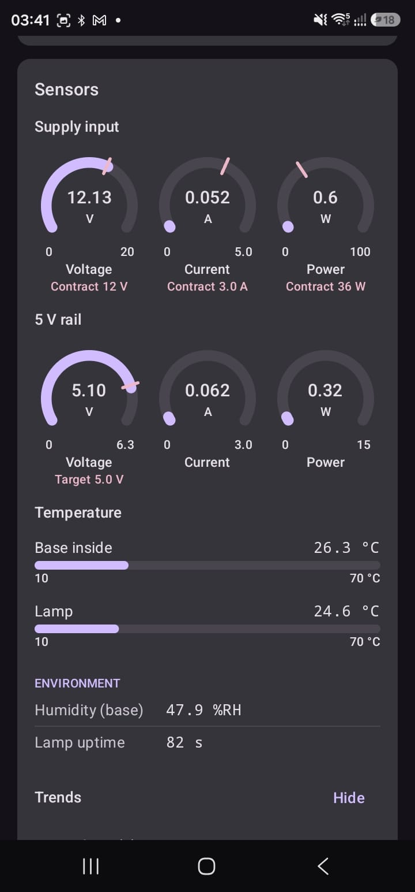
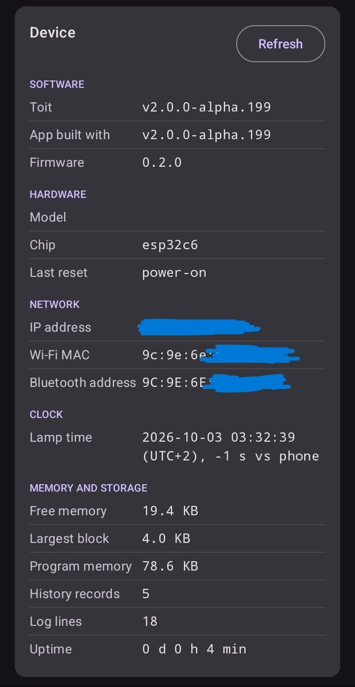
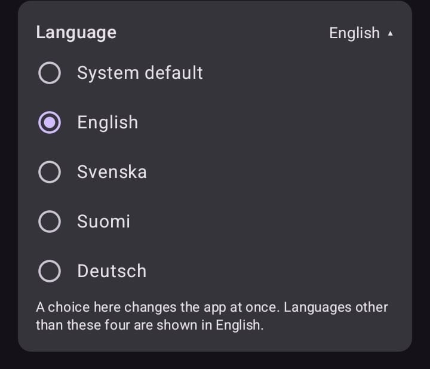

# Project Clock ("OKK Lamp" v002)

A bedside lamp that helps the user wake up and wind down.  Controlled via phone using Bluetooth Low Energy (BLE).  Built originally for people who live with only little daylight in the depths of winter.  White temperature tuning to have warm light in the evening, blue light in the morning, and a ramp up of light at wake up.  No LEDs or other lights to keep the user awake in the evening.

The electronics of this prototype live inside the base of an off-the-shelf table lamp with a linen shade (the original electronics were removed).  The lamp has a ESP32 microcontroller, programmed in [Toit](https://toit.io).  The lamp operates independently as any bedside lamp would, whilst having functionality provided via BLE (by apps) for giving time and alarm information to the device.

## What it does

### The physical lamp

- **Light:** on and off, brightness, and colour temperature from warm (3000 K) to cool (6000 K). Use the phone or the knob on the base.
- **Wake-up light (sunrise):** the light fades up over 1 to 60 minutes and reaches its final brightness and colour temperature at the preferred wake-up time. It can switch itself off after a set time, or stay on.
- **Looks after itself:** has a three channel sensor to measure voltage and current, a sensor for the temperature of the base and separately, of the LED strip/lamp part, and humidity in the base.
- **Consumed USB-C PD power:** as a sink device - if the USB-C supply cannot give the 12 V the LED strip needs, the lamp keeps its light output off and is able to inform the user via the app instead of browning out.
- **A small LED on the base:** dark when the lamp is quiet (a flashing LED could keep the user awake), very faint while an alarm is set, and flashing only to report a fault.
- **A physical knob:** (a rotary encoder with a push switch) with the following actions:

| Action | Result |
|---|---|
| Turn | Brightness up or down in 5 % steps |
| Press | Lamp on or off |
| Hold for 3 s | Switch the knob from changing brightness to changing the colour temperature |
| Hold for more than 10 s | Open a 5 minute window in which a new phone can pair or reconnect |

### The Android app (so far)

> [!TIP]
> [Download it](./android/).  (Entire source code tree will be in the repo with version 1 release.)

| Feature | Image |
|---|---|
| Finds the lamp, pairs with it and reconnects by itself. An optional background service keeps it connected. |  |
| **Follows the phone's next alarm:** the sunrise is timed from whatever alarm the phone will ring next (via Sleep as Android, or any other alarm app).  If the alarm is closer than the sunrise length, the sunrise is skipped. |  |
| **Reading timer:** the lamp stays on for 5 to 90 minutes, then fades out over a minute.   Switching the lamp off ends it early. You can still change the brightness meanwhile.  **Quick actions:** a 10 minute sunrise, a triple flash, and a dim nightlight. |  |
| As well as cards for light controls and the wake-up light/reading timer,  live **sensor** gauges for voltage, and five-minute trend charts. The supply gauges mark the negotiated USB-C power contract.    This prototype had two power rails, 12v for the LEDs, and a boost/buck device ensuring 5v for the ESP32. |  |
| For troubleshooting, a **Device** card (software versions, memory, the lamp's clock) and a **Lamp log**, both with a button to copy the text out. |  |
| A troubleshooting option to shows the intents/broadcasts sent out by Sleep as Android (alarm, snooze, tracking started and stopped).  This is solely as a debugging aid. |  |
| Interface in English, Swedish, Finnish and German (for now). It follows the phone's language, falls back to English, and has a card for choosing a language by hand. | 

## Sleep as Android

- The app will recieve intents from the *Sleep as Android app*, and act on those.
- [If allowed] - the device will also take control directly from the *Sleep as Android* app without the app included in this repository.

> [!CAUTION]
> **Not 100% decided:** The app does not need *Sleep as Android* to run the lamp, however, the lamp was originally designed to be a companion device to *Sleep as Android*, and to not need an app of its own.  To combine these, turn on *Sleep as Android*'s' **Intent API** setting to have the 'OKK Lamp' app hear when an alarm is rescheduled or snoozed etc, so it can gives the required instructions to the Lamp.  Once the Lamp has those instructions, the **lamp** can start the sunrise/ramp up independently of the phone, by using its own internal clock.  In this way a dropped Bluetooth link overnight still allows the light ramp up to function.

## How BLE is used

The lamp is a BLE peripheral. It advertises as `OKK Lamp` and offers three small services, all described in [`BLE Protocol Reference`](docs/ble-protocol-reference.md):

| Service | What it carries |
|---|---|
| **Lamp** | Light state, ramps (sunrise), cues (flash, nightlight), the wake-up alarm plan and the reading timer |
| **Sensor** | Live readings, and a short history kept in the lamp's memory |
| **System** | Status and fault code, time sync, device info, log lines and settings |

### Notes:

- The phone is the BLE central and scans for the Lamp service's UUID. No Wi-Fi, account or cloud is involved, and, whilst capable, the lamp does not need the internet.
- Every message is a small fixed-size packet (at most 20 bytes, little-endian), so it fits the default Bluetooth packet size.
- Pairing is "Just Works" bonding. Reading the status and device info works without pairing; controlling the lamp needs it.
- The lamp has no real-time clock. The phone sets the lamp's clock when it connects.
- The lamp advertises for 5 minutes after it boots, or after the knob is held for more than 10 seconds, and stays discoverable while an alarm is set so the phone can reconnect overnight. One phone is connected at a time.
- The wake-up plan lives in the lamp's memory only. The app writes it again whenever it connects, so a power cut does not lose it for good.

## Hardware (This Build)

- **Controller:** DFRobot Beetle ESP32-C6, running Toit.
- **Light:** a two-channel (warm 3000 K and cool 6000 K) white LED strip driven by PWM.  There is currently no red channel, so no red nightlight.
- **Power:** USB-C Power Delivery, negotiated by a HUSB238 trigger module to negotiate for 12v.
- **Monitoring:** an INA3221 measures the supply input and the 5 V rail, a BME280 reads temperature and humidity inside the base, and a DS18B20 reads the lamp's temperature.
- **Controls:** a rotary encoder with a push switch, and a small indicator LED.

## Where it stands

The Sleep as Android events are still being figured out.  The next-alarm reading and the first versions of the app have been tried on real hardware and function well. Newer parts are still being developed.  Once v1.0 is finished, source code for the app and the code for the ESP32 will live here.

## Modules used in this build.

- [INA3221](https://github.com/milkmansson/toit-ina3221) 3 channel (or [INA226](https://github.com/milkmansson/toit-ina226) - 1 channel) current monitor.
- [HUSB238](https://github.com/milkmansson/toit-husb238) USB-C PD trigger.
- [BME280](https://github.com/toit-pkg/toit-bmx280) as an internal temperature sensor.
- [DS18b20](https://github.com/toitware/toit-ds18b20) as a temperature sensor for the LED strip.
- [Rotary Encoder](https://github.com/milkmansson/toit-rotary-encoder) library managing debouncing and lambdas for rotary encoders.

## Earlier versions and side missions

The first version was built around MQTT to talk to Sleep as Android, and explored a touch sensor, a small display, a real-time clock and GPS time. The phone app and BLE made most of that unnecessary, and this version no longer uses them.  Several of Toit libraries were used, as well as some libraries written whilst on the journey to this device.  All are available at [https://pkg.toit.io](https://pkg.toit.io).

- [MPR121](https://github.com/milkmansson/toit-mpr121) when the device was intended to have touch sensors, not a rotary encoder.
- [Sleep as Android integration](https://github.com/milkmansson/toit-sleep-as-android) (over MQTT).
- [47L16 EERAM](https://github.com/milkmansson/toit-eeram) to store interim data when the device had an RTC, needed to manage timezones, and other information.
- Using an [SSD1306](https://github.com/toitware/toit-ssd1306) to display information, implement a [display manager]() which switches between pages on the display.
- Alternatives were used for some, as earlier physical builds worked somewhat differently (such as [ENS160](https://github.com/milkmansson/toit-ens16x)) and
adapt test [AHT20](https://github.com/davidlao2k/aht20-driver) for the AHT21.
- Use a [DS3231](https://github.com/pkarsy/toit-ds3231) to keep time after power off events.  Many DS3231's have a small flash chip onboard ([cat24c32](https://github.com/toitware/toit-cat24c32)) where information (such as the timezone) could be stored.  Implement a PR for DS3231 Alarm capabilities.
- Get time from GPS instead of internet - leading to a lot of work on various GNSS chipsets and a universal GNSS driver for Toit.

## Not done yet

- Keeping other people's phones out: today anyone in Bluetooth range can pair during the open window. Per-phone keys are designed in the spec but not built.
- A button on the phone's lock screen for a soft night light, for trips to the bathroom.
- Over-temperature protection (a baseline of real temperature data is still required).
- A screen in the app for the history the lamp keeps.
- Snoozing an alarm from the lamp, and switching alarms off when nobody is near it.
- An iPhone app.
- Packaging everything so that someone else can build one from start to finish.
